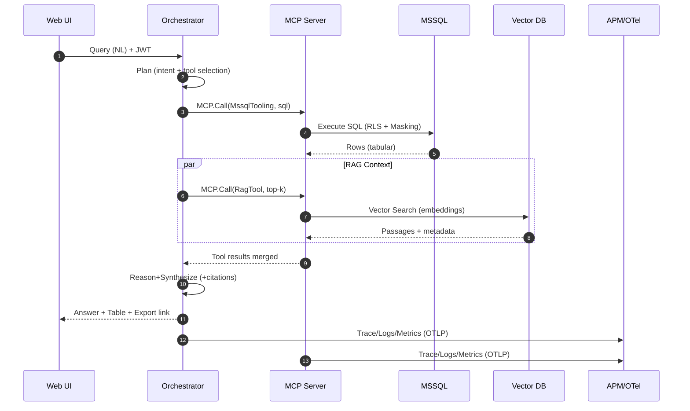
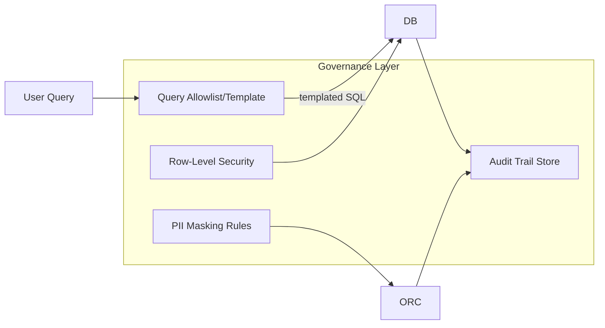

# 📑 Proposal (Draft)

## หัวข้อวิทยานิพนธ์ (Thesis Title)
**Agentic AI Framework โดยใช้ Model Context Protocol (MCP) ร่วมกับ MssqlTooling และ Retrieval-Augmented Generation (RAG) เพื่อสืบค้นข้อมูลลูกค้าบริการสินเชื่อ**

---

## 1. บทนำ (Introduction)

### 1.1 ความเป็นมาและความสำคัญของปัญหา
ระบบบริการสินเชื่อในสถาบันการเงินมักมีฐานข้อมูลขนาดใหญ่ที่เก็บข้อมูลลูกค้า ประวัติการกู้ยืม การชำระหนี้ และนโยบายสินเชื่อ การสืบค้นข้อมูลจากฐานข้อมูลเหล่านี้ด้วยภาษา SQL โดยตรงต้องอาศัยทักษะเฉพาะ ทำให้ผู้ใช้ทั่วไปหรือเจ้าหน้าที่ที่ไม่ใช่สาย IT ประสบปัญหาในการเข้าถึงข้อมูลอย่างมีประสิทธิภาพ  

ในช่วงหลังมานี้ **Agentic AI** และ **Model Context Protocol (MCP)** ได้รับความสนใจในฐานะวิธีมาตรฐานสำหรับการเชื่อมต่อ LLM กับเครื่องมือ (Tooling) ภายนอก เช่น SQL Database ร่วมกับ **Retrieval-Augmented Generation (RAG)** ที่ช่วยให้การตอบกลับมีข้อมูลประกอบที่น่าเชื่อถือมากขึ้น จึงมีศักยภาพสูงในการพัฒนาระบบสืบค้นข้อมูลลูกค้าสินเชื่อที่ใช้ง่าย ถูกต้อง และตรวจสอบได้

### 1.2 วัตถุประสงค์การวิจัย
1. เพื่อออกแบบและพัฒนา **Agentic AI Framework** โดยใช้ MCP Server เชื่อมต่อกับ MSSQL Database ผ่าน MssqlTooling
2. เพื่อผสาน **RAG** ในการดึงบริบท เช่น นโยบายการให้สินเชื่อ หรือคู่มือการใช้งาน เพื่อช่วยให้คำตอบของระบบมีความสมบูรณ์
3. เพื่อประเมินประสิทธิภาพของระบบโดยใช้ **Q&A Test set** และ **Consistency check**

### 1.3 คำถามวิจัย (Research Questions)
- ระบบ Agentic AI + MCP + MssqlTooling + RAG สามารถสืบค้นข้อมูลลูกค้าสินเชื่อได้ถูกต้องเพียงใด?
- RAG มีส่วนช่วยเพิ่มความถูกต้องและความสม่ำเสมอ (consistency) ของคำตอบหรือไม่?
- การตอบสนองของระบบมีความเร็วและใช้งานง่ายในระดับที่เหมาะสมสำหรับผู้ใช้ปลายทางหรือไม่?

### 1.4 ขอบเขตการวิจัย (Scope)
- ใช้ **ฐานข้อมูล MSSQL จำลอง** (synthetic dataset) ที่ประกอบด้วยข้อมูลลูกค้าสินเชื่อ ข้อมูลการกู้ การชำระหนี้
- สร้าง **Prototype MCP Server** ที่เปิดเผย MssqlTooling และ RAG Tool ให้ Agentic AI เรียกใช้
- ทำการทดสอบด้วย **ชุดคำถาม–คำตอบ (Q&A Test Set) จำนวน 15–20 ข้อ**
- เปรียบเทียบ **DB-only Query** กับ **DB+RAG**

### 1.5 ประโยชน์ที่คาดว่าจะได้รับ
- ได้ต้นแบบระบบสืบค้นข้อมูลลูกค้าสินเชื่อที่เป็นมิตรกับผู้ใช้ (user-friendly) และอธิบายได้
- เป็นกรอบแนวทางการประยุกต์ใช้ Agentic AI + MCP + RAG ในระบบสารสนเทศด้านการเงิน
- สนับสนุนการวิจัยเชิงประยุกต์ด้าน **AI for Finance** และ **Explainable AI**

---

## 2. ทบทวนวรรณกรรม (Related Work)

### 2.1 Agentic AI
งาน survey ล่าสุดระบุว่า Agentic AI แตกต่างจาก AI แบบดั้งเดิมเพราะมีความสามารถด้าน **autonomy, adaptability, goal-orientation** และถูกนำไปใช้ในด้านการเงิน การดูแลสุขภาพ และระบบ adaptive software 

### 2.2 Model Context Protocol (MCP)
MCP เป็นมาตรฐานใหม่ (2024–2025) ที่ออกแบบเพื่อเชื่อมต่อ LLM กับ Tooling/Resource ต่าง ๆ อย่างเป็นระบบ รองรับการเรียกใช้ SQL Tool, Vector Store, และ Prompt Template 

### 2.3 Retrieval-Augmented Generation (RAG)
RAG ได้รับการพิสูจน์ว่าเพิ่มความถูกต้องของ LLM โดยการดึง knowledge ภายนอกมาเป็น context และลดการเกิด hallucination เหมาะสำหรับงานที่ต้องใช้ข้อมูล structured + unstructured 

### 2.4 งานวิจัยที่เกี่ยวข้อง

#### งานวิจัยต่างประเทศ
1. Lewis et al. (2020). *Retrieval-Augmented Generation for Knowledge-Intensive NLP Tasks* – นำเสนอ RAG framework สำหรับ QA.
2. OpenAI (2023). *Toolformer: Language Models Can Teach Themselves to Use Tools* – วิธีการฝึก LLM ใช้ API ภายนอก.
3. Microsoft Research (2024). *Guidelines for Agentic AI Systems* – กำหนดหลักการพัฒนา AI แบบ autonomous + safe.
4. Zhang et al. (2022). *Knowledge Graph for Explainable Loan Decision* – ใช้ KG + RAG ในระบบการเงิน.

#### งานวิจัยไทย
5. ชัยวัฒน์ สุขเกษม (2566). *การใช้ Machine Learning ในการวิเคราะห์ความเสี่ยงสินเชื่อรายย่อย* – งานวิจัยภาคการเงินไทย.
6. ศิริพร จิตต์งาม (2565). *การใช้ NLP เพื่อสืบค้นฐานข้อมูลกฎหมาย* – งาน NLP + Query DB.
7. มหาวิทยาลัยเกษตรศาสตร์ (2567). *RAG-based Chatbot สำหรับการศึกษาข้อมูลเกษตร* – ทดลองใช้ RAG กับฐานข้อมูลเชิงวิชาการไทย.
8. ธนาคารแห่งประเทศไทย (2564). *AI for Financial Services Survey Report* – รายงานสำรวจการใช้ AI ในระบบการเงินไทย.

#### ตารางสรุปงานวิจัยที่เกี่ยวข้อง

| ลำดับ | ผู้วิจัย/หน่วยงาน | ปี | หัวข้อ | แนวทาง/เทคโนโลยี | ความเกี่ยวข้อง |
|-------|-------------------|----|--------|------------------|----------------|
| 1 | Lewis et al. | 2020 | Retrieval-Augmented Generation | RAG Framework | รากฐานเทคนิค RAG |
| 2 | OpenAI | 2023 | Toolformer | LLM + Tool Use | วิธีฝึก LLM ใช้ Tools |
| 3 | Microsoft Research | 2024 | Agentic AI Guidelines | Safe Agentic AI | กรอบการออกแบบ AI อัตโนมัติ |
| 4 | Zhang et al. | 2022 | Explainable Loan Decision | KG + RAG | ระบบสินเชื่ออธิบายได้ |
| 5 | ชัยวัฒน์ สุขเกษม | 2566 | วิเคราะห์ความเสี่ยงสินเชื่อรายย่อย | ML + Credit Risk | งานการเงินไทย |
| 6 | ศิริพร จิตต์งาม | 2565 | NLP สืบค้นฐานข้อมูลกฎหมาย | NLP + DB Search | Query DB แบบภาษาไทย |
| 7 | ม.เกษตรศาสตร์ | 2567 | RAG Chatbot เกษตร | RAG Chatbot | ตัวอย่าง chatbot RAG ไทย |
| 8 | ธนาคารแห่งประเทศไทย | 2564 | AI for Financial Services | AI Survey | บริบทการเงินไทย |

---

## 3. ระเบียบวิธีวิจัย (Methodology)

### 3.1 การออกแบบระบบ (System Design)
1. **ฐานข้อมูล MSSQL**: สร้าง schema ข้อมูลลูกค้าสินเชื่อ (Customer, Loan, Payment)
2. **MCP Server**: เปิดเผย tools ได้แก่
   - `MssqlTooling` → query MSSQL
   - `RagTool` → ดึง context จาก policy/เอกสาร
3. **Agentic AI**: รับคำถามจากผู้ใช้ → Plan tool call → Query DB + RAG → สรุปผลลัพธ์

### 3.2 การสร้าง Q&A Test Set
- เตรียมคำถาม 15–20 ข้อ ครอบคลุม
  - Lookup (ยอดหนี้ของลูกค้า A)
  - Aggregation (จำนวนการกู้ใหม่ในเดือนสิงหาคม)
  - Filter + Join (ลูกค้าที่ค้างชำระ >30 วัน)
  - Policy (เกณฑ์อนุมัติสินเชื่อ)
- สร้าง **Ground Truth Answer** จาก SQL Query + เอกสารประกอบ

### 3.3 การประเมินผล (Evaluation)
- **Accuracy**: วัดคำตอบตรงกับ ground truth
- **Consistency**: ทำซ้ำหลายรอบและทดสอบ paraphrase → ดูคำตอบเหมือนกันกี่ %
- **Response Time**: เวลาที่ใช้ในการตอบกลับ
- **(เสริม) Usability**: แบบสอบถามผู้ใช้

### 3.4 ตารางวัตถุประสงค์–ตัวชี้วัด–วิธีการประเมิน

| วัตถุประสงค์ | ตัวชี้วัด (Metrics) | วิธีการประเมิน |
|---------------|----------------------|------------------|
| พัฒนา Agentic AI Framework เชื่อมต่อ MCP + MSSQL | ความถูกต้องของ query และผลลัพธ์ (Accuracy %) | ทดสอบด้วย Q&A Test Set เปรียบเทียบกับ Ground Truth |
| ผสาน RAG เพื่อเสริมความสมบูรณ์ของคำตอบ | ความครบถ้วน (Completeness), ลด Hallucination | เปรียบเทียบผล DB-only กับ DB+RAG, ตรวจสอบ grounded references |
| ประเมินคุณภาพการตอบของระบบ | Accuracy, Consistency, Response Time | ทำ Intra-run test, Paraphrase test, Inter-model test |
| ตรวจสอบการใช้งานจริง | คะแนนความพึงพอใจผู้ใช้ (Usability Score) | แบบสอบถาม 5-point Likert scale หรือ SUS |

### 3.5 เครื่องมือที่ใช้
- MSSQL Server
- MCP Server (Custom implementation)
- LLM API (OpenAI / Local LLM)
- Vector DB (เช่น Qdrant, FAISS)

---

## 4. แผนการดำเนินงาน (Timeline)
- เดือน 1–2: ศึกษางานวิจัยและออกแบบระบบ
- เดือน 3–4: สร้างฐานข้อมูล MSSQL และพัฒนา MCP Server + Tools
- เดือน 5–6: รวม RAG และสร้าง Prototype
- เดือน 7: เตรียม Q&A Test Set และ Ground Truth
- เดือน 8: ทำการทดสอบและเก็บผล
- เดือน 9: วิเคราะห์ผลและเขียนวิทยานิพนธ์

---

## 5. สรุป
หัวข้อวิจัยนี้มีความใหม่และเหมาะสมกับระดับปริญญาโท เน้นการสร้าง **prototype** ที่ผสาน Agentic AI, MCP Server, MssqlTooling และ RAG เพื่อสืบค้นข้อมูลลูกค้าสินเชื่อ และมีการวัดผลด้วย Q&A Test Set + Consistency check เพื่อประเมินคุณภาพและความน่าเชื่อถือของระบบ


---

## 6. สถาปัตยกรรมระบบ (Architecture Overview)

> มุมมองระดับระบบ (System Context + Containers) พร้อมจุดบูรณาการ MCP, RAG, และ MSSQL สำหรับงานสืบค้นข้อมูลลูกค้าสินเชื่อ

### 6.1 Context & Container Diagram (C4-ish)
```mermaid
flowchart LR
  subgraph User[ผู้ใช้]
    U1[Loan Officer]
    U2[Data Analyst]
    U3[Admin]
  end

  subgraph FE[Web UI (Next.js/Tailwind)]
    FE1[Chat/Search UI]
    FE2[Result Table/Export]
    FE3[Admin Console]
  end

  subgraph ORC[Agentic Orchestrator]
    OR1[Planner/Policy]
    OR2[Tool Router]
    OR3[Reasoner/Synthesizer]
    OR4[Guardrails/PII Mask]
  end

  subgraph MCP[MCP Server (.NET 9 Minimal API)]
    T1[[MssqlTooling]]
    T2[[RagTool]]
    T3[[Audit/Tracing API]]
  end

  subgraph DATA[Data Plane]
    DB[(MSSQL)]
    VEC[(Vector DB: Qdrant/FAISS)]
    DOC[(Policy/Docs Repo)]
  end

  subgraph OBS[Observability]
    APM[Elastic APM/OTel]
    LOGS[(Logs)]
    METRICS[(Metrics)]
    TRACES[(Traces)]
  end

  U1 & U2 & U3 --> FE
  FE -->|JWT/OIDC| ORC
  ORC -->|MCP Protocol| MCP
  MCP -->|SQL Query| DB
  MCP -->|Vector Search| VEC
  VEC <-->|Embeddings Sync| DOC
  ORC -->|OTLP| APM
  MCP -->|OTLP| APM
  FE -->|Download/Export| FE2
  APM --> TRACES
  APM --> METRICS
  APM --> LOGS
```

### 6.2 Deployment Diagram (Kubernetes)
```mermaid
flowchart TB
  subgraph K8S[Kubernetes Cluster]
    subgraph ns-app[Namespace: agentic-ai]
      fe[fe-web (Next.js)]:::pod
      orc[orchestrator (.NET/Python)]:::pod
      mcp[mcp-server (.NET 9)]:::pod
      vec[vector-db (Qdrant)]:::state
      apm[elastic-apm-agent]:::sidecar
    end
    subgraph ns-data[Namespace: data]
      mssql[(SQL Server 2022)]:::state
      object[(Object Storage for Docs/Policy)]:::state
    end
  end
  user[Users] --> fe
  fe --> orc
  orc --> mcp
  mcp --> mssql
  mcp --> vec
  vec <-->|embeddings| object
  classDef pod fill:#eef7ff,stroke:#3895ff;
  classDef sidecar fill:#fff7e6,stroke:#ff9900;
  classDef state fill:#f3f4f6,stroke:#6b7280;
```

### 6.3 Agentic Execution Flow (Request → Answer)


### 6.4 Data & Governance


**แนวทางกำกับดูแล**
- **PII Masking**: บังคับที่ Orchestrator + DB (Dynamic Data Masking)
- **Row-Level Security**: จำกัดข้อมูลตาม role/claims ของผู้ใช้
- **Allowlist/Template**: จำกัด SQL ที่ agent สามารถยิงได้
- **Audit Trail**: เก็บ Prompt, Tool Calls, SQL, Context, Output พร้อม TraceId

### 6.5 Components & Responsibilities
- **Web UI**: Auth (OIDC/JWT), Chat/Search UI, ตารางผลลัพธ์, Export CSV/XLSX/PDF, Admin Console
- **Agentic Orchestrator**: Planner/Reasoner, Tool Router (MCP client), Guardrails & Policy Enforcement, Post‑processor (table, citations)
- **MCP Server**: จัดการ tools ให้มาตรฐานเดียว (MssqlTooling, RagTool, Audit API), ใช้งานง่ายจากหลาย orchestrators
- **MSSQL**: แหล่ง truth สำหรับข้อมูลธุรกรรมสินเชื่อ + RLS + Masking + View สำหรับ query
- **Vector DB**: เก็บ embeddings ของเอกสารนโยบาย/คู่มือ พร้อม metadata/versioning
- **Observability Stack**: OpenTelemetry → Elastic APM/Grafana; Dashboard: latency/accuracy/consistency (eval jobs)

### 6.6 Non‑Functional Considerations
- **Performance**: Connection pool MSSQL, async I/O, caching results ชั่วคราว (per-user scope) ตามนโยบาย
- **Scalability**: Stateless services (FE/ORC/MCP) + HPA; แยก read replicas ของ MSSQL หากจำเป็น
- **Security**: mTLS ระหว่าง service, JWT scopes (read/report/admin), Secrets via K8s Secrets/SOPS
- **Resilience**: Circuit breaker/Retry/Timeout (Polly), fallbacks (DB-only เมื่อ RAG ล่ม)
- **Compliance**: Data retention, lineage ของ embeddings (version tag), reproducible indexing config (YAML)
``

