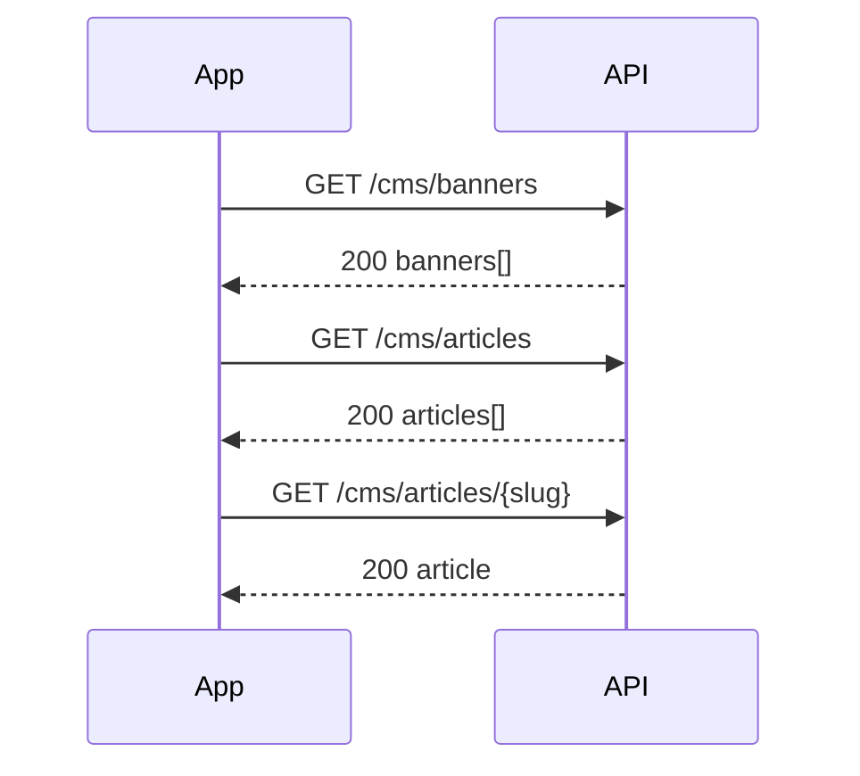

# Feature Flow: CMS / Content

> This document maps the user journey to the related APIs (OpenAPI 3.1.0 spec from previous package). All paths are under base `/api/v1`.

## Flow Overview


## Step ↔ API Mapping
- Banners → `GET /cms/banners`
- List articles → `GET /cms/articles`
- Article detail → `GET /cms/articles/{slug}`


## Common HTTP Status Codes
- **200 OK** — success
- **201 Created** — resource created
- **202 Accepted** — async processing
- **400 Bad Request** — validation_error
- **401 Unauthorized** — missing/invalid token
- **403 Forbidden** — not allowed
- **404 Not Found** — resource not found
- **409 Conflict** — idempotency conflict / state conflict
- **422 Unprocessable Entity** — business rule violation
- **429 Too Many Requests** — rate limited
- **500 Internal Server Error** — server error


### Error Model
```json
{
  "error": "<code>",
  "message": "<human readable message>",
  "traceId": "00-<w3c-trace>-01"
}
```
