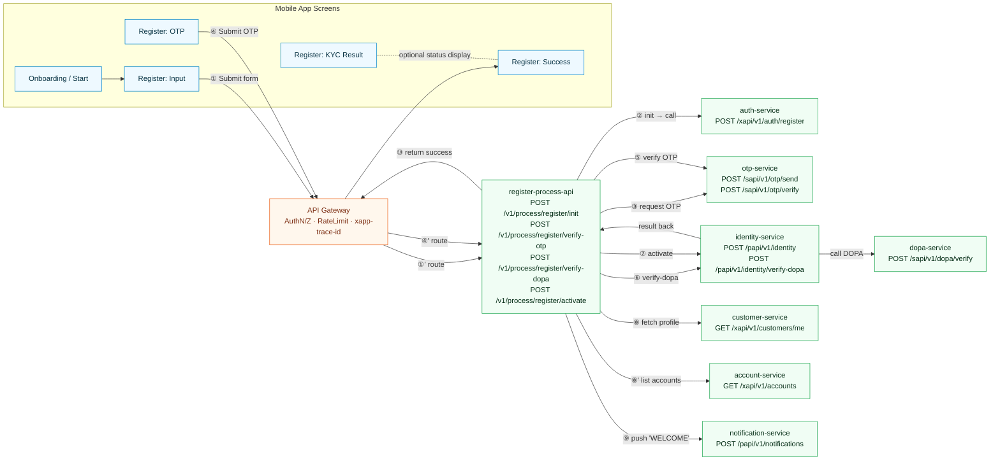

# 01 – Register (Gateway → Process API → System APIs)

```mermaid
flowchart LR
  %% ===== App Screens =====
  subgraph APP[Mobile App Screens]
    R0["Onboarding / Start"]
    R1["Register: Input"]
    R2["Register: OTP"]
    R3["Register: KYC Result"]
    R4["Register: Success"]
  end

  %% ===== Gateway =====
  GW["API Gateway<br/>AuthN/Z · RateLimit · xapp-trace-id"]

  %% ===== Process API =====
  PAPI["register-process-api<br/>POST /v1/process/register/init<br/>POST /v1/process/register/verify-otp<br/>POST /v1/process/register/verify-dopa<br/>POST /v1/process/register/activate"]

  %% ===== System APIs =====
  AUTH["auth-service<br/>POST /xapi/v1/auth/register"]
  OTP["otp-service<br/>POST /sapi/v1/otp/send<br/>POST /sapi/v1/otp/verify"]
  IDEN["identity-service<br/>POST /papi/v1/identity<br/>POST /papi/v1/identity/verify-dopa"]
  DOPA["dopa-service<br/>POST /sapi/v1/dopa/verify"]
  CUST["customer-service<br/>GET /xapi/v1/customers/me"]
  ACC["account-service<br/>GET /xapi/v1/accounts"]
  NOTI["notification-service<br/>POST /papi/v1/notifications"]

  %% ===== Numbered Flow =====
  R0 --> R1
  R1 -->|① Submit form| GW -->|①' route| PAPI
  PAPI -->|② init → call| AUTH
  PAPI -->|③ request OTP| OTP

  R2 -->|④ Submit OTP| GW -->|④' route| PAPI
  PAPI -->|⑤ verify OTP| OTP

  PAPI -->|⑥ verify-dopa| IDEN
  IDEN -->|call DOPA| DOPA
  IDEN -->|result back| PAPI

  PAPI -->|⑦ activate| IDEN
  PAPI -->|⑧ fetch profile| CUST
  PAPI -->|⑧' list accounts| ACC

  PAPI -->|⑨ push 'WELCOME'| NOTI
  PAPI -->|⑩ return success| GW --> R4
  R3 -. optional status display .- R4


%% ===== Styles =====
classDef screen fill:#eef9ff,stroke:#0284c7,color:#083344;
classDef gw fill:#fff7ed,stroke:#ea580c,color:#7c2d12;
classDef svc fill:#f0fdf4,stroke:#16a34a,color:#052e16;

  class R0,R1,R2,R3,R4 screen
  class GW gw
  class PAPI,AUTH,OTP,IDEN,DOPA,CUST,ACC,NOTI svc
```
