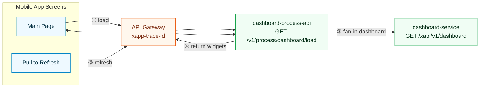

# 05 – Main Page / Dashboard

```mermaid
flowchart LR
  subgraph APP[Mobile App Screens]
    M1["Main Page"]
    M2["Pull to Refresh"]
  end

  GW["API Gateway<br/>xapp-trace-id"]
  PAPI["dashboard-process-api<br/>GET /v1/process/dashboard/load"]

  DASH["dashboard-service<br/>GET /xapi/v1/dashboard"]

  M1 -->|① load| GW --> PAPI
  M2 -->|② refresh| GW --> PAPI
  PAPI -->|③ fan-in dashboard| DASH
  PAPI -->|④ return widgets| GW --> M1


%% ===== Styles =====
classDef screen fill:#eef9ff,stroke:#0284c7,color:#083344;
classDef gw fill:#fff7ed,stroke:#ea580c,color:#7c2d12;
classDef svc fill:#f0fdf4,stroke:#16a34a,color:#052e16;

  class M1,M2 screen
  class GW gw
  class PAPI,DASH svc
```
