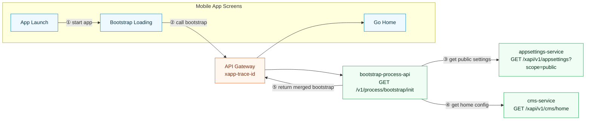

# 04 – App Settings Bootstrap

```mermaid
flowchart LR
  subgraph APP[Mobile App Screens]
    A0["App Launch"]
    A1["Bootstrap Loading"]
    A2["Go Home"]
  end

  GW["API Gateway<br/>xapp-trace-id"]
  PAPI["bootstrap-process-api<br/>GET /v1/process/bootstrap/init"]

  APPSET["appsettings-service<br/>GET /xapi/v1/appsettings?scope=public"]
  CMS["cms-service<br/>GET /xapi/v1/cms/home"]

  A0 -->|① start app| A1 -->|② call bootstrap| GW --> PAPI
  PAPI -->|③ get public settings| APPSET
  PAPI -->|④ get home config| CMS
  PAPI -->|⑤ return merged bootstrap| GW --> A2


  %% ===== Styles =====
  classDef screen fill:#eef9ff,stroke:#0284c7,color:#083344;
  classDef gw fill:#fff7ed,stroke:#ea580c,color:#7c2d12;
  classDef svc fill:#f0fdf4,stroke:#16a34a,color:#052e16;

  class A0,A1,A2 screen
  class GW gw
  class PAPI,APPSET,CMS svc
```
