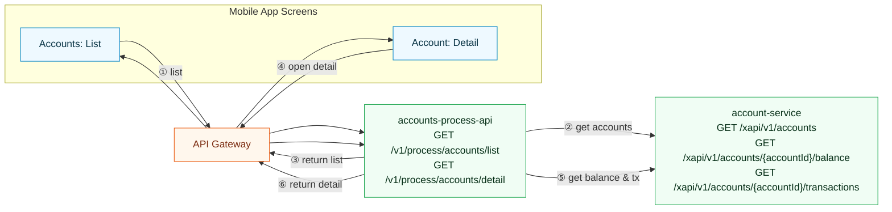

# 06 – Accounts (List & Detail)

```mermaid
flowchart LR
  subgraph APP[Mobile App Screens]
    A1["Accounts: List"]
    A2["Account: Detail"]
  end

  GW["API Gateway"]
  PAPI["accounts-process-api<br/>GET /v1/process/accounts/list<br/>GET /v1/process/accounts/detail"]

  ACC["account-service<br/>GET /xapi/v1/accounts<br/>GET /xapi/v1/accounts/{accountId}/balance<br/>GET /xapi/v1/accounts/{accountId}/transactions"]

  A1 -->|① list| GW --> PAPI
  PAPI -->|② get accounts| ACC
  PAPI -->|③ return list| GW --> A1

  A2 -->|④ open detail| GW --> PAPI
  PAPI -->|⑤ get balance & tx| ACC
  PAPI -->|⑥ return detail| GW --> A2


  %% ===== Styles =====
  classDef screen fill:#eef9ff,stroke:#0284c7,color:#083344;
  classDef gw fill:#fff7ed,stroke:#ea580c,color:#7c2d12;
  classDef svc fill:#f0fdf4,stroke:#16a34a,color:#052e16;

  class A1,A2 screen
  class GW gw
  class PAPI,ACC svc
```
