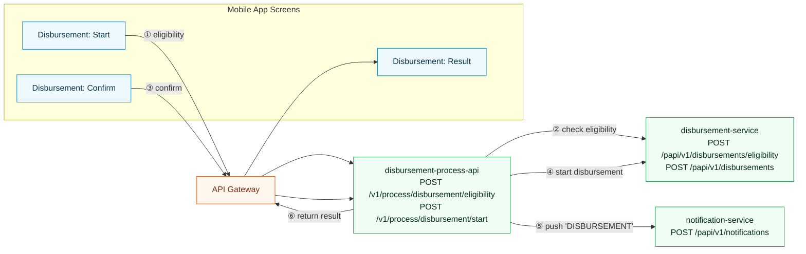

# 09 – Disbursement

```mermaid
flowchart LR
  subgraph APP[Mobile App Screens]
    D1["Disbursement: Start"]
    D2["Disbursement: Confirm"]
    D3["Disbursement: Result"]
  end

  GW["API Gateway"]
  PAPI["disbursement-process-api<br/>POST /v1/process/disbursement/eligibility<br/>POST /v1/process/disbursement/start"]

  DISB["disbursement-service<br/>POST /papi/v1/disbursements/eligibility<br/>POST /papi/v1/disbursements"]
  NOTI["notification-service<br/>POST /papi/v1/notifications"]

  D1 -->|① eligibility| GW --> PAPI
  PAPI -->|② check eligibility| DISB
  D2 -->|③ confirm| GW --> PAPI
  PAPI -->|④ start disbursement| DISB
  PAPI -->|⑤ push 'DISBURSEMENT'| NOTI
  PAPI -->|⑥ return result| GW --> D3


  %% ===== Styles =====
  classDef screen fill:#eef9ff,stroke:#0284c7,color:#083344;
  classDef gw fill:#fff7ed,stroke:#ea580c,color:#7c2d12;
  classDef svc fill:#f0fdf4,stroke:#16a34a,color:#052e16;

  class D1,D2,D3 screen
  class GW gw
  class PAPI,DISB,NOTI svc
```
