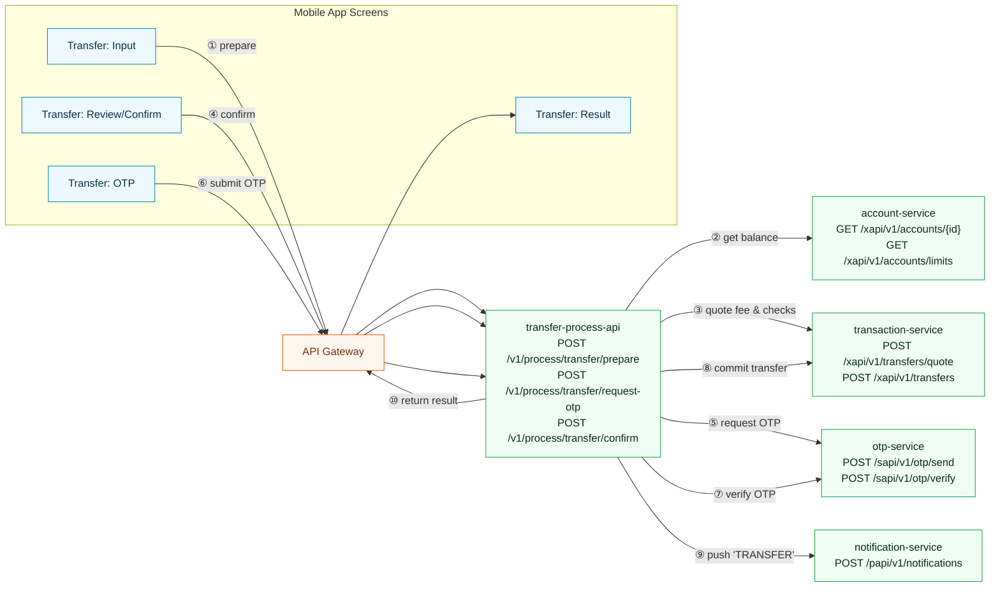

# 08 – Transfer

```mermaid
flowchart LR
  subgraph APP[Mobile App Screens]
    T1["Transfer: Input"]
    T2["Transfer: Review/Confirm"]
    T3["Transfer: OTP"]
    T4["Transfer: Result"]
  end

  GW["API Gateway"]
  PAPI["transfer-process-api<br/>POST /v1/process/transfer/prepare<br/>POST /v1/process/transfer/request-otp<br/>POST /v1/process/transfer/confirm"]

  ACC["account-service<br/>GET /xapi/v1/accounts/{id}<br/>GET /xapi/v1/accounts/limits"]
  TX["transaction-service<br/>POST /xapi/v1/transfers/quote<br/>POST /xapi/v1/transfers"]
  OTP["otp-service<br/>POST /sapi/v1/otp/send<br/>POST /sapi/v1/otp/verify"]
  NOTI["notification-service<br/>POST /papi/v1/notifications"]

  T1 -->|① prepare| GW --> PAPI
  PAPI -->|② get balance| ACC
  PAPI -->|③ quote fee & checks| TX

  T2 -->|④ confirm| GW --> PAPI
  PAPI -->|⑤ request OTP| OTP

  T3 -->|⑥ submit OTP| GW --> PAPI
  PAPI -->|⑦ verify OTP| OTP
  PAPI -->|⑧ commit transfer| TX

  PAPI -->|⑨ push 'TRANSFER'| NOTI
  PAPI -->|⑩ return result| GW --> T4


%% ===== Styles =====
classDef screen fill:#eef9ff,stroke:#0284c7,color:#083344;
classDef gw fill:#fff7ed,stroke:#ea580c,color:#7c2d12;
classDef svc fill:#f0fdf4,stroke:#16a34a,color:#052e16;

  class T1,T2,T3,T4 screen
  class GW gw
  class PAPI,ACC,TX,OTP,NOTI svc
```
