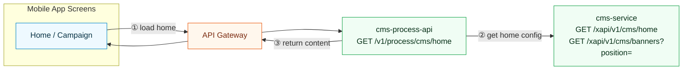

# 11 – CMS Content (Home/Promotions)

```mermaid
flowchart LR
  subgraph APP[Mobile App Screens]
    C1["Home / Campaign"]
  end

  GW["API Gateway"]
  PAPI["cms-process-api<br/>GET /v1/process/cms/home"]

  CMS["cms-service<br/>GET /xapi/v1/cms/home<br/>GET /xapi/v1/cms/banners?position="]

  C1 -->|① load home| GW --> PAPI
  PAPI -->|② get home config| CMS
  PAPI -->|③ return content| GW --> C1


%% ===== Styles =====
classDef screen fill:#eef9ff,stroke:#0284c7,color:#083344;
classDef gw fill:#fff7ed,stroke:#ea580c,color:#7c2d12;
classDef svc fill:#f0fdf4,stroke:#16a34a,color:#052e16;

  class C1 screen
  class GW gw
  class PAPI,CMS svc
```
