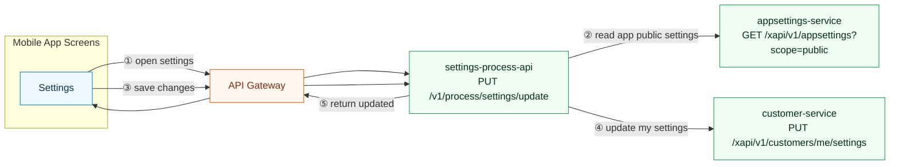

# 12 – Settings (Profile & Preferences)

```mermaid
flowchart LR
  subgraph APP[Mobile App Screens]
    S1["Settings"]
  end

  GW["API Gateway"]
  PAPI["settings-process-api<br/>PUT /v1/process/settings/update"]

  CUST["customer-service<br/>PUT /xapi/v1/customers/me/settings"]
  APPSET["appsettings-service<br/>GET /xapi/v1/appsettings?scope=public"]

  S1 -->|① open settings| GW --> PAPI
  PAPI -->|② read app public settings| APPSET
  S1 -->|③ save changes| GW --> PAPI
  PAPI -->|④ update my settings| CUST
  PAPI -->|⑤ return updated| GW --> S1


%% ===== Styles =====
classDef screen fill:#eef9ff,stroke:#0284c7,color:#083344;
classDef gw fill:#fff7ed,stroke:#ea580c,color:#7c2d12;
classDef svc fill:#f0fdf4,stroke:#16a34a,color:#052e16;

  class S1 screen
  class GW gw
  class PAPI,CUST,APPSET svc
```
