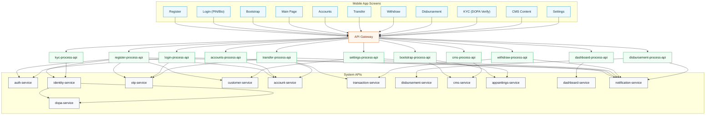

# Overall – All Flows (High-level)

```mermaid
flowchart TB
  subgraph APP[Mobile App Screens]
    O1["Register"]
    O2["Login (PIN/Bio)"]
    O3["Bootstrap"]
    O4["Main Page"]
    O5["Accounts"]
    O6["Transfer"]
    O7["Withdraw"]
    O8["Disbursement"]
    O9["KYC (DOPA Verify)"]
    O10["CMS Content"]
    O11["Settings"]
  end

  GW["API Gateway"]

  %% Process APIs
  PR1["register-process-api"]
  PR2["login-process-api"]
  PR3["bootstrap-process-api"]
  PR4["dashboard-process-api"]
  PR5["accounts-process-api"]
  PR6["transfer-process-api"]
  PR7["withdraw-process-api"]
  PR8["disbursement-process-api"]
  PR9["kyc-process-api"]
  PR10["cms-process-api"]
  PR11["settings-process-api"]

  %% System APIs (grouped)
  subgraph SYS[System APIs]
    AUTH["auth-service"]
    IDEN["identity-service"]
    DOPA["dopa-service"]
    OTP["otp-service"]
    CUST["customer-service"]
    ACC["account-service"]
    TX["transaction-service"]
    DISB["disbursement-service"]
    CMS["cms-service"]
    APPSET["appsettings-service"]
    DASH["dashboard-service"]
    NOTI["notification-service"]
  end

  O1 --> GW --> PR1
  O2 --> GW --> PR2
  O3 --> GW --> PR3
  O4 --> GW --> PR4
  O5 --> GW --> PR5
  O6 --> GW --> PR6
  O7 --> GW --> PR7
  O8 --> GW --> PR8
  O9 --> GW --> PR9
  O10 --> GW --> PR10
  O11 --> GW --> PR11

  PR1 --> AUTH
  PR1 --> IDEN
  IDEN --> DOPA
  PR1 --> OTP
  PR1 --> CUST
  PR1 --> ACC
  PR1 --> NOTI

  PR2 --> AUTH
  PR2 --> OTP
  PR2 --> NOTI

  PR3 --> APPSET
  PR3 --> CMS

  PR4 --> DASH

  PR5 --> ACC

  PR6 --> ACC
  PR6 --> TX
  PR6 --> OTP
  PR6 --> NOTI

  PR7 --> TX
  PR7 --> NOTI

  PR8 --> DISB
  PR8 --> NOTI

  PR9 --> IDEN
  IDEN --> DOPA

  PR10 --> CMS

  PR11 --> CUST
  PR11 --> APPSET


%% ===== Styles =====
classDef screen fill:#eef9ff,stroke:#0284c7,color:#083344;
classDef gw fill:#fff7ed,stroke:#ea580c,color:#7c2d12;
classDef svc fill:#f0fdf4,stroke:#16a34a,color:#052e16;

  classDef sys fill:#f8fafc,stroke:#334155,color:#0f172a;
  class O1,O2,O3,O4,O5,O6,O7,O8,O9,O10,O11 screen
  class GW gw
  class PR1,PR2,PR3,PR4,PR5,PR6,PR7,PR8,PR9,PR10,PR11 svc
  class AUTH,IDEN,DOPA,OTP,CUST,ACC,TX,DISB,CMS,APPSET,DASH,NOTI sys
```
