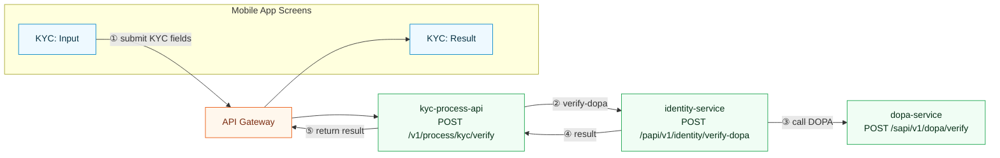

# 10 – DOPA Verify (KYC)

```mermaid
flowchart LR
  subgraph APP[Mobile App Screens]
    K1["KYC: Input"]
    K2["KYC: Result"]
  end

  GW["API Gateway"]
  PAPI["kyc-process-api<br/>POST /v1/process/kyc/verify"]

  IDEN["identity-service<br/>POST /papi/v1/identity/verify-dopa"]
  DOPA["dopa-service<br/>POST /sapi/v1/dopa/verify"]

  K1 -->|① submit KYC fields| GW --> PAPI
  PAPI -->|② verify-dopa| IDEN
  IDEN -->|③ call DOPA| DOPA
  IDEN -->|④ result| PAPI
  PAPI -->|⑤ return result| GW --> K2


  %% ===== Styles =====
  classDef screen fill:#eef9ff,stroke:#0284c7,color:#083344;
  classDef gw fill:#fff7ed,stroke:#ea580c,color:#7c2d12;
  classDef svc fill:#f0fdf4,stroke:#16a34a,color:#052e16;

  class K1,K2 screen
  class GW gw
  class PAPI,IDEN,DOPA svc
```
