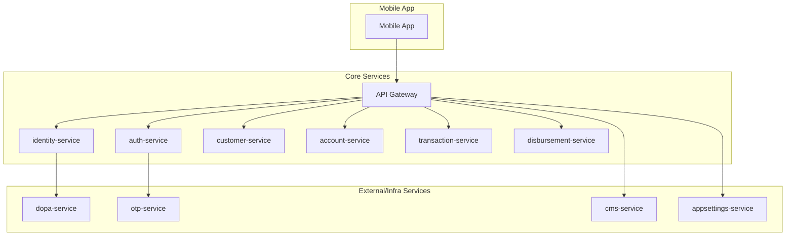

ได้เลยครับ! ด้านล่างนี้คือ **สรุปภาพรวมของ Microservice Architecture: Minimal Version + Disbursement + Core External Services (DOPA, OTP, CMS, App Settings)**
ที่ออกแบบให้เหมาะกับ **Mobile Banking App** รุ่นเริ่มต้น แต่พร้อมขยายได้ในอนาคต

---

## ✅ 1. **Feature Scope (Minimal Version + External & Infra)**

| กลุ่มฟีเจอร์            | รายละเอียด                                                 |
| ----------------------- | ---------------------------------------------------------- |
| **Authentication**      | Register, Login (PIN/Bio), Verify OTP                      |
| **User Identity**       | Create user, Verify citizen ID (DOPA), Store biometric/PIN |
| **Main Page**           | Summary ของบัญชี, ยอดเงิน                                  |
| **Accounts**            | ข้อมูลบัญชี, ยอดคงเหลือ                                    |
| **Withdraw / Transfer** | ถอนเงิน, โอนเงิน                                           |
| **Disbursement**        | จ่ายเงินกู้, cashback, refund                              |
| **Settings**            | เปลี่ยน language, theme, alert toggle                      |
| **CMS**                 | Config UI หน้า app เช่น banner, homepage cards             |

---

## 🧩 2. **Microservices Overview**

| Service                     | Description                                     | API Prefix                          |
| --------------------------- | ----------------------------------------------- | ----------------------------------- |
| 🟩 **api-gateway**          | รับ request จาก mobile → route ไปยัง services   | `/auth`, `/register`, `/main`, etc. |
| 🟦 **auth-service**         | Login, Register, Token, Biometric, PIN          | `/auth/...`                         |
| 🟦 **identity-service**     | สร้าง/ยืนยันข้อมูล identity (citizen, pin, bio) | `/identity/...`                     |
| 🟦 **customer-service**     | ข้อมูลลูกค้า, settings                          | `/customers/...`                    |
| 🟦 **account-service**      | บัญชี, ยอดเงิน                                  | `/accounts/...`                     |
| 🟦 **transaction-service**  | โอนเงิน, ถอนเงิน, ประวัติธุรกรรม                | `/transactions/...`                 |
| 🟧 **disbursement-service** | จ่ายเงิน (loan/cashback/refund)                 | `/disbursements/...`                |
| 🟨 **dopa-service**         | ตรวจสอบเลขประชาชนกับ DOPA                       | `/dopa/verify`                      |
| 🟨 **otp-service**          | ส่งและยืนยัน OTP (SMS/Email/Push)               | `/otp/send`, `/otp/verify`          |
| 🟨 **cms-service**          | Config หน้าจอ banner/card/menu ใน mobile app    | `/cms/home`, `/cms/banners`         |
| 🟨 **appsettings-service**  | ตั้งค่าแอป (theme, language, toggle)            | `/settings/app`, `/settings/user`   |

---

## 🔁 3. Request Flow Examples

### 🔐 Register Flow

```
Mobile → Gateway → auth-service
    → identity-service → dopa-service
    → otp-service
    → customer-service
    → account-service
```

### 💸 Disbursement Flow

```
Core system → disbursement-service
    → account-service (credit account)
    → transaction-service (record tx)
```

### 🏠 Main Page (App เปิดขึ้นมา)

```
Mobile → Gateway → customer-service
        → account-service
        → transaction-service (latest tx)
        → cms-service
        → appsettings-service
```

---

## 📦 4. API Sample (Per Service)

### auth-service

```http
POST /auth/register
POST /auth/login
POST /auth/biometric
```

### identity-service

```http
POST /identity/create
POST /identity/verify-pin
POST /identity/verify-biometric
```

### dopa-service

```http
POST /dopa/verify
```

### otp-service

```http
POST /otp/send
POST /otp/verify
```

### customer-service

```http
GET /customers/me
PUT /customers/me/settings
```

### account-service

```http
GET /accounts
GET /accounts/{id}/balance
```

### transaction-service

```http
POST /transfer
POST /withdraw
GET /transactions
```

### disbursement-service

```http
POST /disbursements/request
GET /disbursements/{id}/status
```

### cms-service

```http
GET /cms/home
GET /cms/banners
```

### appsettings-service

```http
GET /settings/app
PUT /settings/user
```

---

## 📊 5. Overall Architecture Diagram (Mermaid)



---

## 📌 สรุป Key Benefits

* 🧱 Modular พร้อมแยก Dev team ได้
* ⚙️ รองรับ horizontal scaling
* 🔁 พร้อมเพิ่ม async/event-driven ในอนาคต
* 🔐 Security และ Trace แยกตาม service
* 💡 CMS + AppSettings ช่วยให้ client app ปรับ config ได้โดยไม่ต้อง deploy ใหม่

---

ถ้าคุณต้องการ step ถัดไป เช่น

* 🛠️ Clean Architecture Code Template (.NET)
* 📄 YAML/JSON API Spec หรือ Postman Collection
* 📑 markdown รายชื่อ endpoint
* 🧪 Mock Data & Agentic AI Use Case for Log Analysis

บอกได้เลยครับ จะทำให้ทันทีครับ 💪
